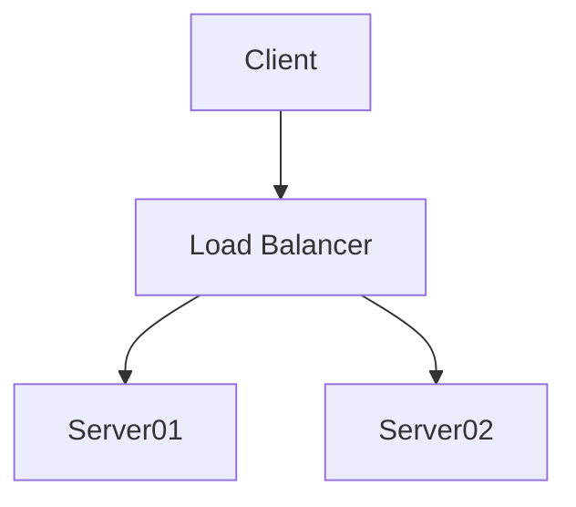

# About Content v2



```javascript
function fizzbuzz() {
  for (let i = 0; i < 100; i++) {
    console.log(
      i % 15 === 0 ? 'fizzbuzz' :
      i % 3  === 0 ? 'fizz' :
      i % 5  === 0 ? 'buzz' : ''
    )
  }
}
```

[Back home](/)
